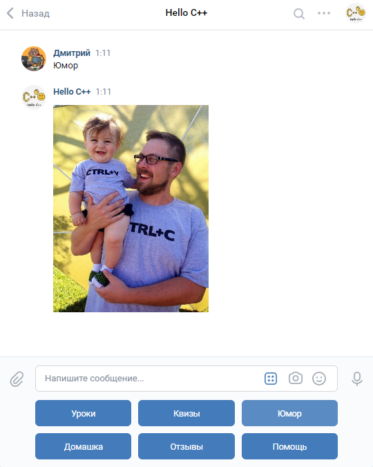

## Мое портфолио
Я разместил здесь примеры моего кода вместе с кратким описанием того, какие задачи этот код решает. Это мои личные проекты или решения некоторых задач с курсов, которые я проходил за последние 3 года. 

### 1. Кластеризация точек на плоскости и визуализация результата 
[C++, Cmake, dlib, libpng], 2019. 
Это одно из домашних заданий по курсу "С++ Developer. Professional" от компании OTUS. Я его проходил в 2019 году и считаю, что этот [код можно показать](https://github.com/zazicam/otus-cpp-hw15).

### 2. Шаблонный класс 2-мерной разреженой бесконечной матрицы 
[С++, Cmake, GTest (google testing framework)], 2019.
Также задание по курсу "С++ Developer. Professional" 2019 года. [Пример кода с использованием шаблонов С++](https://github.com/zazicam/otus-cpp-hw6)

### 3. Командная оболочка для Linux на языке Си
[C, linux], 2021.
Это довольно интересное задание из курса cs5600 ("Компьютерные системы / Операционные системы"). По сути надо написать свой аналог bash или zsh. В задании дается "скелет" командной оболочки с большим количеством комментариев по реализации и прилагаются 70 тестов для проверки корректности выполнения. Задача - написать все недостающие функции так, чтобы прошли все тесты. [Подробное описание задания и мое решение по ссылке](https://github.com/zazicam/simple-shell)

### 4. Библиотека libbox для создания консольных игр (для обучения основам С++)
[C++, WinApi, VisualStudio], 2020
Я достаточно много преподавал С++ школьниками и студентам. При этом одной из проблем освоения языка С++ является отсутствие простых и удобных библиотек для начинающих (если сравнивать, например, с языком Python). Как преподавателю мне тоже не хватало такой библиотеки, поэтому я написал ее сам. Она позволяет быстрее и проще создавать консольные программы с подвижной цветной псевдографикой. Поддерживает работу с цветным текстовым дисплеем, клавиатурой, таймером и генератором псевдослучайных чисел. Конечно, это все просто обертки над WinApi и объектами стандартной библиотеки, но они удобнее и проще для начинающих. [Примеры использования библиотеки и ее исходный код  выложен тут](https://github.com/zazicam/libbox).

### 5. Группа вк "Hello С++" c обучающим ботом для школьников.
[Python, bash, vkapi, raspberri-pi], 2020
Это еще один мой проект, связанный с преподаванием программирования. Для своей группы вк, посвященной языку С++ для школьников я написал обучаеющего бота "Машу". Код бота я выкладывать не хочу, потому что это не С++, а Python. Я его плохо знаю и писал бота очень "второпях". Однако, бот заработал и с тех пор уже пару лет им пользуются мои ученики, да и просто все желающие. [Моя вк группа с ботом по этой ссылке](https://vk.com/hellocpp).

Бот запущен у меня дома на Raspberri Pi B+ c 512МБ ОЗУ и вполне справляется с 10-20 учениками одновременно. За 1-ый год более 100 школьников полностью прошли мой курс, решив по 36 задач и получим [сертификаты](https://vk.com/hellocpp?z=album-188945143_270957481) и за это время более 1000 человек поучаствовали в квизах по С++. Вот,  например, [результаты квиза по указателям](https://vk.com/page-188945143_54279347) и [результаты квиза по теме "Функции"](https://vk.com/page-188945143_54270129). При этом проблемы возникают только когда у меня отключают интернет, а также раз в несколько месяцев приходится чистить логи и удалять бэкапы (так как sd-карточка там всего на 8Гб).

Бот Маша умеет:
+ отправлять задачки по запросу из моего курса по С++ для школьников,
+ проверять правильность их решения (получает файл .cpp, компилирует, прогоняет через тесты, сохраняет результаты, отправляет отчеты),
+ проводить квизы по С++ для школьников и студентов (отправляет вопрос, проверяет ответ, выдает объяснения, если нужно, вести статистику),
+ выдавать программистские шуточки и мемы (выбираются из списка случайным образом).

