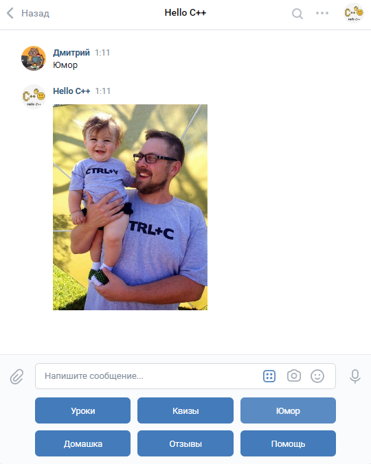

### Группа вк "Hello С++" c обучающим ботом для школьников.
[Python, bash, vkapi], 2020
Это еще один мой проект, связанный с преподаванием программирования. Для своей группы вк, посвященной языку С++ для школьников я написал обучаеющего бота "Машу". Код бота я выкладывать не хочу, потому что это не С++, а Python. Я его плохо знаю и писал бота очень "второпях". Однако, бот заработал и с тех пор уже пару лет им пользуются мои ученики, да и просто все желающие. [Моя вк группа с ботом по этой ссылке](https://vk.com/hellocpp).

Бот запущен у меня дома на Raspberri Pi B+ c 512МБ ОЗУ и вполне справляется с 10-20 учениками одновременно. За 1-ый год более 100 школьников полностью прошли мой курс, решив по 36 задач и получим [сертификаты](https://vk.com/hellocpp?z=album-188945143_270957481) и за это время более 1000 человек поучаствовали в квизах по С++. Вот,  например, [результаты квиза по указателям](https://vk.com/page-188945143_54279347) и [результаты квиза по теме "Функции"](https://vk.com/page-188945143_54270129). При этом проблемы возникают только когда у меня отключают интернет, а также раз в несколько месяцев приходится чистить логи и удалять бэкапы (так как sd-карточка там всего на 8Гб).

Бот Маша умеет:
+ отправлять задачки по запросу из моего курса по С++ для школьников,
+ проверять правильность их решения (получает файл .cpp, компилирует, прогоняет через тесты, сохраняет результаты, отправляет отчеты),
+ проводить квизы по С++ для школьников и студентов (отправляет вопрос, проверяет ответ, выдает объяснения, если нужно, вести статистику),
+ выдавать программистские шуточки и мемы (выбираются из списка случайным образом).

